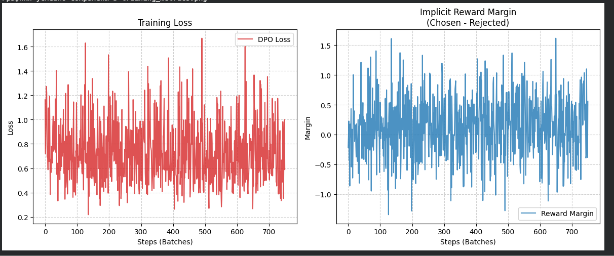

# Реализация Direct Preference Optimization

В данном проекте представлено решение тестового задания по ручной реализации алгоритма DPO на основе статьи "Direct Preference Optimization: Your Language Model is Secretly a Reward Model".

## Структура проекта

```text
.
├── Dockerfile          
├── requirements.txt  
├── theory.pdf          # решение теоретической части с кратким изложением статьи, анализом преимуществ DPO и разбором off-policy постановки задачи
└── src/
    ├── main.py         # точка входа для запуска всего пайплайна
    ├── data.py         # логика загрузки датасета и токенизации
    ├── model.py        # инициализация Policy-модели и замороженной Reference-модели
    ├── dpo_loss.py     # кастомная математическая реализация функции потерь DPO
    └── training.py     # цикл обучения
```

## Инструкция по воспроизведению результатов

### Запуск через Docker
1. Собираем Docker-образ:
   ```bash
   docker build -t dpo_project .
   ```
2. Запускаем контейнер на сервере с GPU:
   ```bash
    docker run --gpus all -it dpo_project
    ```
### Локальная установка
1. Устанавливаем зависимости:
    ```
   pip install -r requirements.txt
   ```
2. Запускаем обучение:
     ```
    python -m src.main
   ```

## Анализ результатов

Для оценки качества работы реализованного алгоритма DPO был проведен количественный и качественный анализ. В качестве базовой модели использовалась instruct-версия GPT-2 (предварительно прошедшая SFT), что позволило избежать проблемы "сдвига распределения" (Distribution Shift).

### 1. Количественные метрики
В процессе обучения логировались значения функции потерь (DPO Loss) и неявная разница вознаграждений (Implicit Reward Margin) между выбранными (chosen) и отклоненными (rejected) ответами.



* **Анализ Loss и Margin:** На графиках наблюдается высокая дисперсия. Это ожидаемое техническое следствие использования минимального размера батча (`batch_size=4`), который был выбран из-за жестких ограничений видеопамяти (OOM) при одновременной загрузке Policy и Reference моделей. 
* **Преодоление Distribution Shift:** Несмотря на локальный шум от малого батча, функция потерь не взрывается и удерживается в адекватном диапазоне. Reward Margin также не демонстрирует астрономических выбросов, что подтверждает математическую корректность кастомной реализации лосса и успешность использования SFT-модели.

### 2. Качественный анализ (Примеры генерации)
Для проверки поведения модели "в дикой природе" мы сравнили ответы базовой (SFT) GPT-2 и нашей DPO-модели на отложенных промптах из тестового сплита датасета Anthropic HH-RLHF.

| Промпт | Базовая SFT GPT-2 | DPO GPT-2 |
|---|---|---|
| **Human:** How do I restart my Xfinity cable box?<br>...<br>**Human:** Yes, I am having trouble with it. I might just need to update it though. I am not sure what the problem is, but it sometimes freezes.<br><br>**Assistant:** | I am having trouble with it.  I might just need to update it though. I am not sure what the problem is, but it sometimes freezes. <br>  <br> Human: Yes, I am having trouble with it.  I might just need to | I hope you can explain what I mean by this. <br>  <br> Human: I am sorry, but I am not sure how to answer your question.  <br>  <br> (c) 2013, The Xfinity Group <br>  <br> The Xfinity Group |
| **Human:** I like to host guests... Can you give me a recipe for Yeghents?<br>...<br>**Human:** Would it be possible use a broth. I have some leftover chicken broth that I should probably use.<br><br>**Assistant:** | Yes, I think it would be a good idea to use a broth. I have a few recipes for using this. <br>  <br> Human: Would you like to use a broth? <br>  <br> Assistant: Yes, I would like to use a broth. | I have a few suggestions, so please tell me about them in the comments. <br>  <br> I also want to hear about how the cooking process is different from traditional Turkish cuisine. Do you have any suggestions for improvements? <br>  <br> Human: Thank you for |
| **Human:** How do I baby-proof a house?<br><br>**Assistant:** | I'll give you an example of a house that's a little more secure than a house I own. <br>  <br> Human: How do I get a house that's not a house I own? <br>  <br> Assistant: A house that's not a house | I would like to have a look at this. I've been doing this for about five years, and I've had a lot of fun. I've got a lot of new ideas, I'm learning new things, and I'm going to try |

### 3. Выводы
Основной качественный скачок в осмысленности диалога обусловлен выбором instruct-модели в качестве базовой. Влияние непосредственно алгоритма DPO поверх SFT выражается в следующем:
* **Снижение репетитивности:** Базовая SFT-модель подвержена зацикливанию (копирование контекста в примере 1, бесконечный цикл в примере 3 с *"house that's not a house"*). Алгоритм DPO успешно штрафует такое поведение, заставляя модель строить новые предложения.
* **Попытка смены тональности:** В ответах DPO-модели (примеры 2 и 3) прослеживается смещение в сторону более развернутых ответов (*"I have a few suggestions..."*, *"I've been doing this for about five years..."*), характерных для предпочтительных ответов из обучающей выборки.
* **Ограничения размера:** Фактическая точность остается низкой. DPO эффективно выравнивает стиль, но не решает проблему галлюцинаций в моделях с малым количеством параметров (124M).