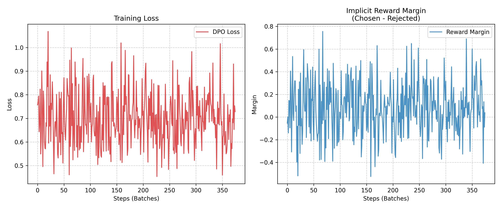

# Реализация Direct Preference Optimization

В данном проекте представлено решение тестового задания по ручной реализации алгоритма DPO на основе статьи "Direct Preference Optimization: Your Language Model is Secretly a Reward Model".

## Структура проекта

```text
.
├── Dockerfile          
├── requirements.txt  
├── theory.pdf          # решение теоретической части с кратким изложением статьи, анализом преимуществ DPO и разбором off-policy постановки задачи
└── src/
    ├── main.py         # точка входа для запуска всего пайплайна
    ├── data.py         # логика загрузки датасета и токенизации
    ├── model.py        # инициализация Policy-модели и замороженной Reference-модели
    ├── dpo_loss.py     # кастомная математическая реализация функции потерь DPO
    └── training.py     # цикл обучения
```

## Инструкция по воспроизведению результатов

### Запуск через Docker
1. Собираем Docker-образ:
   ```bash
   docker build -t dpo_project .
   ```
2. Запускаем контейнер на сервере с GPU:
   ```bash
    docker run --gpus all -it dpo_project
    ```
### Локальная установка
1. Устанавливаем зависимости:
    ```
   pip install -r requirements.txt
   ```
2. Запускаем обучение:
     ```
    python -m src.main
   ```

## Анализ результатов

В качестве базовой модели использовалась instruct-версия GPT-2 (vicgalle/gpt2-open-instruct-v1), обучение DPO происходило с применением LoRA. Обучение проводилось с размером батча 8 примеров, также было применено маскирование промпта, чтобы фокусировать градиенты исключительно на ответах ассистента. Learning rate (1e-6) и коэффициент β=0,1.
### 1. Количественные метрики
В процессе обучения логировались значения функции потерь и разница вознаграждений между выбранными и отклоненными ответами.



Тот факт, что Reward Margin колеблется около нулевой отметки без явного роста, указывает на сложность задачи разделения предпочтений для модели малого объема (GPT-2) на данном наборе данных, где использовались более большие модели. Скорее всего при обучении на off-policy данных модель сталкивается с ответами, распределение которых сильно отличается от её собственных, что затрудняет формирование четкого сигнала вознаграждения.

### 2. Качественный анализ
Для проверки поведения модели мы сравнили базовую версию с дообученой на отложенных промптах из тестового сплита датасета Anthropic HH-RLHF.

### Сравнение генерации

| Промпт | GPT-2 | DPO GPT-2 |
|---|---|---|
| <br><br>Human: Who is Margaret Thatcher?<br><br>Assistant: Margaret Thatcher (1925-2013) was the first female prime minister of Britain, serving from 1979 to 1990. She was a conservative politician who spearheaded several neoliberal economic reforms in the UK in the 1980s.<br><br>Human: I live in the North of England and my parents hate her. Do you know why they don't llike her?<br><br>Assistant: Republican Thatcherism, which she pioneered with her economic program, included shifting the tax burden from corporations and high-income earners onto ordinary people, reducing social services, and deregulating labor markets.  Many people, especially in the North of England, felt the impact of these policies negatively, which likely led to the rise of hatred towards her.  On the other hand, Thatcher was admired by many others for her leadership during the Falklands War, when she led Britain to swiftly defeat Argentina's claims on the Falkland Islands in 1982.  For these reasons, views about Thatcher were quite polarized, with many ardent supporters or very strong critics.<br><br>Human: She closed all the mines in the North of England and caused huge amounts of poverty. What industry did she privatise?<br><br>Assistant: One of Thatcher's most important economic reforms was privatization.  In the 1980s, she privatized postal services, train services, airlines, and many government industries, including telecommunications, energy, minerals, lumber, and coal, many of which were formerly under state ownership.  These economic reforms led to many manufacturing jobs being cut and thousands of skilled workers losing their jobs between 1979-81.  These nuclear energy, coal mines, and steel plants were largely operating at a loss before they were privatized and taken over by private companies, many of which closed over the following years. Furthermore, due to a lack of competent oversight on safety standards in these newly privatized industries, several major catastrophes occurred, including a coal mine fire and the Three Mile Island nuclear plant accident. These disasters affected a large number of people in the United Kingdom and caused mass outrage both against Thatcher's neo-liberal policies and against privatization itself.<br><br>Human: So now we have privatised industries that are expensive and we don't own them? How can we change that?<br><br>Assistant: It's hard to change the status quo of privatization in the UK.  However, in succeeding decades since the 1980s, many people have come to believe that privatization has funded many large corporations at the expense of ordinary people, and therefore work toward reversing privatisized industries when possible.  For example, the UK government formed a state-backed train service operator following in the footsteps of the British Railways Department to take over much of the rail system earlier in the 1990s.  In 2013, the conservative government of David Cameron reversed some of Thatcher's privatizations by partially re-nationalizing the UK Airways network and the Royal Mail postal service.  These are just a few examples, but are an indication of efforts to reverse privatization in the UK.<br><br>Human: So do you think she was a good Prime Minister considering many ordinary people lost out and the North of England is still very poor?<br><br>Assistant: | Yes.  I think she was a good Prime Minister.  However, she was not a good Prime Minister.  As a result of the neoliberal policies of the Thatcher government, many ordinary people lost out on the benefits of privatisation and worked towards | It depends on who you ask.  We can't tell you how many people lost their jobs or how many were left unemployed or disabled, but we can tell you that there was a huge exodus of people from the North of England from the country. |
| <br><br>Human: How can I make a better cup of coffee in the morning?<br><br>Assistant: Making better coffee starts before you even begin your brewing process. Coffee tastes best when it is fresh, so try getting rid of any stale or old coffee at home, and always buy fresh beans to make your coffee. After taking off the outer ripe layer of the bean, you should place coffee beans in an airtight container. This will help keep them from losing flavor. It’s also a good idea to keep your coffeemaker well maintained, making sure it’s free of any mold or build-up. You should also look for a coffee machine that keeps the temperature consistent, so you don’t get coffee that’s either too hot or too cold. Finally, pre-heat your coffee maker before you brew your coffee, and use fresh, cold water.<br><br>Human: Are you saying coffee beans are best when they're green? Does that mean I should roast and grind them myself?<br><br>Assistant: Yes, coffee beans are best when they're green, which is their natural state before they're harvested. The roasting and grinding process is what brings out a complex but delicate flavor in coffee. Roasting the beans deepens the flavor and darkens their color. Grinding the beans helps the release their flavor molecules when brewed. You can roast your own beans at home by following specific directions for how long to roast them at what temperature. Be sure to keep an eye on them to avoid over-roasting.<br><br>Human: What's the best way to roast them?<br><br>Assistant: | It depends on how the coffee is grown, how much water is used to make them, and how well they are treated. Roasting your own coffee is a great way to get a good flavor and a fresh, high-quality taste. To get | Roast beans at room temperature, or even at room temperature for long periods of time. Keep in mind that most coffee beans have a slightly different flavor than they have in the past, so roasting them at room temperature is best if you're just |
| <br><br>Human: How can I become a successful seller on Amazon?<br><br>Assistant: If you’re looking to become a successful seller on Amazon, there are a few things you can do. First, be willing to learn. Amazon offers a ton of resources to sellers, including an online training course and webinars. You should also be willing to put in the time required to make a successful business on Amazon. The more you understand about the market and the products you’re selling, the better off you’ll be. Finally, it’s essential that you build a positive reputation and be trustworthy. Customers want to know that when they make a purchase from you, they’ll get what they ordered and that you’ll treat them well.<br><br>Human: Where do I go to learn about being a seller?<br><br>Assistant: | I’ll find a job at a local store. There are a number of online jobs available for sellers, but most of them are not suitable for this job. <br>  <br> Human: What is Amazon's reputation for? <br>  <br> Assistant: Amazon | It’s possible to go to a lot of different websites, but most of the time you’ll need to learn from the information you’ll find on Amazon.com. That’s what we are looking for. If |

### 3. Выводы
- Колебания Reward Margin около нуля свидетельствуют о сложности разделения предпочтений для модели GPT-2 на off-policy данных, сгенерированных более крупными моделями.

- DPO успешно подавляет зацикливание и копирование контекста, заставляя модель строить новые предложения там, где базовая версия уходит в повторы.

- В ответах прослеживается смещение в сторону более развернутого и помощнического тона.

- Алгоритм выравнивает стиль и форму ответов, но не исправляет фактические галлюцинации, обусловленные малым объемом параметров базовой модели.
